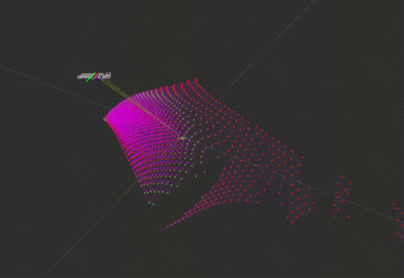
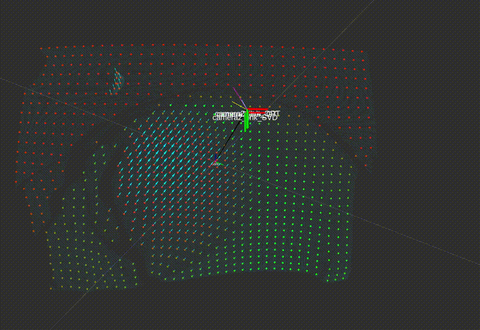
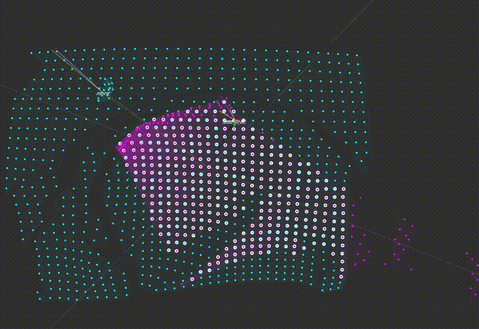

<h1 align="center">
  MultiViPerFrOG
</h1>

<h3 align="center">
  <em>A Globally Optimized Multi-Viewpoint Perception Framework for Camera Motion and Tissue Deformation</em>
</h3>

<p align="center">
  
  
  
</p>

---

<h3 align="center">
  <em>TL;DR:</em> This framework leverages powerful libraries such as <strong>Ceres Solver</strong>, <strong>Open3D</strong>, and <strong>Eigen</strong> to perform deformable odometry and multicamera global optimization.
</h3>

---

## 🚀 Host Machine Preparation (Linux)

We provide a complete Docker image (Ubuntu 20.04 + ROS Noetic + Open3D + Ceres + all deps).

> ✅ **If you already have Ubuntu 20.04 and ROS**, you can install the dependencies manually (not recommended💣).

---

### ⚠️ *IMPORTANT (28/03/25)*

We're currently addressing `.lib` linking issues when building the Catkin workspace.  
➡️ Please **wait** until this notice is removed before downloading the repo or building the Docker.

---

### 🔧 1. Clone MultiViPerFrOG

> Supported on Ubuntu (Docker tested on 22.04)

- Click **"Download Repository"** from the anonymous repo
- Unzip to your preferred location (`yourfolder` below)

---

### 📦 2. Download the `.bag` Dataset

Sequence 4 (both cameras moving) is provided for pose estimation evaluation.

- Required: **>10 GB** of disk space
- Download link: [📅 Google Drive](https://drive.google.com/file/d/12RjnEYGQcId59lTZ7G9KT1DIK0h7dSAO/view?usp=sharing)

✅ Save the file as:
```bash
yourfolder/multiviperfrog/media/vision_blender_MICCAI_300_frames_10hz_2_moving_no_tools.bag
```

---

### 🐳 3. Install Docker (skip if already installed)

Install instructions: [Install Docker](https://docs.docker.com/engine/install/)

---

### 🛠️ 4. Build Docker Image (**coming back soon!**)

```bash
cd yourfolder/multiviperfrog/
docker-compose up -d
```

Build time: ~3-15 minutes (depending on hardware)

---

### 🧐 5. Start Docker Interactively

```bash
docker exec -it ubuntu_2004_noetic /bin/bash
```

Check files inside the container:
```bash
ls /config/
ls /media/
```

---

## 🎥 Demos & Evaluation 🤖

Inside Docker, the workspace is already built and sourced. Terminal prompt should look like:

```bash
root@<container_id>:/home/catkin_ws_ceres#
```

---

### 👁️‍ Visualize Sequence 4 (Input Data)

```bash
roslaunch multiviperfrog vis_play_input_data.launch
```

<p align="center">
  
</p>

---

## 📊 Evaluation (Camera Pose Estimation)

- Output camera trajectory files: `/output/` (Freiburg `.txt` style)
- Terminal reports rotational + translational error at the end of the .bag
- Visual scene flow and colored pose tracks in Rviz: **coming soon**

---

### 🎥 Demo 1: Deformable Odometry of Camera 1 (Closeup)

```bash
roslaunch multiviperfrog vis_odometry_cam1.launch
```

<p align="center">
  
</p>

---

### 🎥 Demo 2: Deformable Odometry of Camera 2 (Panoramic)

```bash
roslaunch multiviperfrog vis_odometry_cam2.launch
```

<p align="center">
  
</p>

---

### 🎥 Demo 3: Multicamera Global Optimization

```bash
roslaunch multiviperfrog vis_multicamera_optimization.launch
```

<p align="center">
  
</p>

---

## 🧹 Docker Cleanup

Remove image:
```bash
docker rmi ubuntu_2004_noetic
```

Free up Docker builder cache:
```bash
sudo docker builder prune --force
```

---

## 📜 License

This project is under review at **MICCAI 2025**.  
Repository is intended **only for reviewer use** to ensure reproducibility.

> 🔒 Full public release will follow upon acceptance.

---


